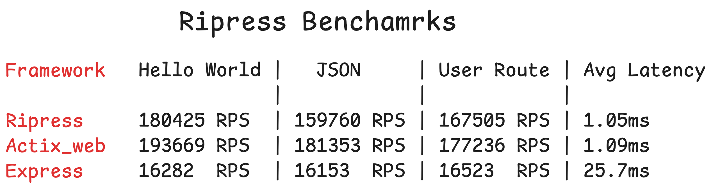

# HexStack

[](https://crates.io/crates/hexstack)
[](LICENSE)

### A modern, full-stack web framework for Rust

Please star the repo if you like it, so that I know someone is using it.

## What is HexStack?

HexStack is a complete, modern web framework for Rust that combines the familiar developer experience of Express.js with the performance and safety of Rust. HexStack brings together three powerful libraries to create a unified full-stack development experience:

- **[Ripress](https://github.com/guru901/ripress)** - Lightning-fast HTTP server (97% of Actix-Web performance)
- **[Wynd](https://github.com/guru901/wynd)** - Simple, powerful WebSocket server
- **[Lume](https://github.com/guru901/lume)** - Type-safe ORM with intuitive API _(coming soon)_

## Why Choose HexStack?

**🚀 Unmatched Performance**

- HTTP performance: 97% of Actix-Web speed
- WebSocket performance: Built on Tokio for maximum async efficiency
- Nearly 10x faster than Express.js + Socket.io

**💡 Superior Developer Experience**

- Express.js-familiar API that feels natural
- Type-safe from the ground up
- Comprehensive CLI for rapid scaffolding
- Seamless integration between all components

**⚡ Modern Architecture**

- Async/await support throughout
- HTTP/2 support via Hyper
- Real-time WebSocket capabilities
- Production-ready from day one



## Table of Contents

- [Overview](#overview)
- [Features](#features)
- [Installation](#installation)
- [CLI Usage](#cli-usage)
- [Examples](#examples)
- [Documentation](#documentation)
- [Ecosystem](#ecosystem)
- [Changelog](#changelog)

---

## Overview

HexStack is designed to be the Rails/Laravel of the Rust ecosystem - a complete, opinionated framework that provides everything you need to build modern web applications. With its CLI tool, you can scaffold new projects in seconds and start building immediately.

## Features

- **🔧 Powerful CLI** - Scaffold projects with `hexstack new`
- **🌐 HTTP + WebSocket** - Unified server handling both protocols
- **📦 Zero Configuration** - Works out of the box with sensible defaults
- **🏗️ Multiple Templates** - HTTP-only, WebSocket-only, or full-stack apps
- **🛡️ Type Safety** - Compile-time guarantees throughout the stack
- **🚀 Hot Reload** - Fast development iteration _(coming soon)_
- **📊 Built-in Middleware** - CORS, logging, file uploads, rate limiting
- **🔄 Real-time Ready** - WebSocket support for live features

---

## Installation

Install HexStack CLI globally:

```sh
cargo install hexstack
```

Or add individual components to an existing project:

```sh
cargo add ripress wynd
cargo add tokio --features macros,rt-multi-thread
```

## CLI Usage

### Create a New Project

```sh
# Full-stack HTTP + WebSocket application
hexstack new my-app --template full

# HTTP-only application
hexstack new my-api --template http

# WebSocket-only application
hexstack new my-ws --template websocket
```

### Available Templates

- **`http`** - Ripress HTTP server only
- **`websocket`** - Wynd WebSocket server only
- **`full`** - Ripress + Wynd integrated server _(default)_

### Project Structure

```
my-app/
├── Cargo.toml
├── src/
│   ├── main.rs
│   ├── routes/
│   │   └── mod.rs
│   └── websocket/
│       └── mod.rs
├── static/
└── README.md
```

## Examples

### Full-Stack Application

```rust
use ripress::{app::App, types::RouterFns};
use wynd::wynd::{Wynd, WithRipress};

#[tokio::main]
async fn main() {
    let mut wynd: Wynd<WithRipress> = Wynd::new();
    let mut app = App::new();

    // WebSocket handling
    wynd.on_connection(|conn| async move {
        conn.on_text(|event, handle| async move {
            let _ = handle.send_text(&format!("Echo: {}", event.data)).await;
        });
    });

    // HTTP routes
    app.get("/", |_, res| async move {
        res.ok().text("Welcome to HexStack!")
    });

    app.get("/api/health", |_, res| async move {
        res.ok().json(json!({"status": "healthy"}))
    });

    // Mount WebSocket
    app.use_wynd("/ws", wynd.handler());

    app.listen(3000, || {
        println!("🚀 HexStack server running on http://localhost:3000");
        println!("📡 WebSocket available at ws://localhost:3000/ws");
    })
    .await;
}
```

### HTTP-Only Application

```rust
use ripress::{app::App, types::RouterFns};

#[tokio::main]
async fn main() {
    let mut app = App::new();

    app.get("/", |_, res| async move {
        res.ok().json(json!({"message": "Hello from HexStack!"}))
    });

    app.use_cors(None)
        .use_rate_limiter(None);

    app.listen(3000, || {
        println!("🚀 HexStack API running on http://localhost:3000");
    })
    .await;
}
```

### WebSocket-Only Application

```rust
use wynd::wynd::{Wynd, Standalone};

#[tokio::main]
async fn main() {
    let mut wynd: Wynd<Standalone> = Wynd::new();

    wynd.on_connection(|conn| async move {
        println!("Client connected");

        conn.on_text(|event, handle| async move {
            println!("Received: {}", event.data);
            let _ = handle.send_text("Message received!").await;
        });

        conn.on_binary(|event, handle| async move {
            let _ = handle.send_binary(event.data.clone()).await;
        });
    });

    wynd.listen(3000, || {
        println!("📡 WebSocket server running on ws://localhost:3000");
    })
    .await
    .unwrap();
}
```

View more examples in the [Examples](./examples/) directory.

## Get Started

Ready to build something amazing? Get started in 30 seconds:

```sh
# Install HexStack CLI
cargo install hexstack

# Create a new full-stack app
hexstack new my-app

# Navigate and run
cd my-app
cargo run
```

Your server will be running on `http://localhost:3000` with WebSocket support at `ws://localhost:3000/ws`.

## Documentation

- [Getting Started Guide](./docs/getting-started.md)
- [CLI Reference](./docs/cli-reference.md)
- [HTTP Server Guide](./docs/guides/http-server.md)
- [WebSocket Guide](./docs/guides/websocket.md)
- [Deployment Guide](./docs/guides/deployment.md)
- [API Reference](./docs/api-reference/)

## Ecosystem

HexStack is built on top of these powerful libraries:

### [Ripress](https://github.com/guru901/ripress) - HTTP Server

- 97% of Actix-Web performance
- Express.js-inspired API
- Built-in middleware ecosystem
- Production ready v1.0+

### [Wynd](https://github.com/guru901/wynd) - WebSocket Server

- Event-driven async API
- Automatic connection management
- Type-safe message handling
- Seamless HTTP integration

### [Lume](https://github.com/guru901/lume) - ORM _(Coming Soon)_

- Type-safe queries
- Schema-first approach
- Migration system
- Relationship handling

## Performance

HexStack delivers exceptional performance across the stack:

- **HTTP**: 97% of Actix-Web performance
- **WebSocket**: Full async/concurrent connections
- **Memory**: Efficient connection and resource management
- **Throughput**: 10x faster than Express.js + Socket.io equivalents

## Contributing

We don't take contributions yet, but your feedback is always welcome!
If you have any questions or suggestions, feel free to reach out to us on [X](https://x.com/Gurvinder_911).

## License

This project is licensed under the MIT License - see the [LICENSE](LICENSE) file for details.

---

_HexStack v0.3.0 - The Future of Rust Web Development_ ⚡
